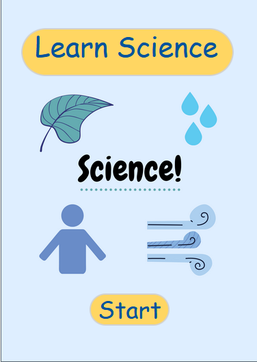

# Learn Science App
* ShellHacks 2020 Team Project

## Inspiration/What it Does
* Learn Science is an app that teaches students basic science concepts through visuals and animations.

## What's Next for Learn Science
* We hope to build on the concepts taught through our app.

